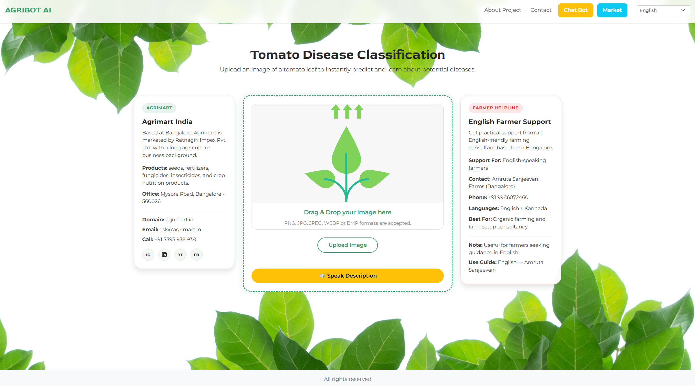
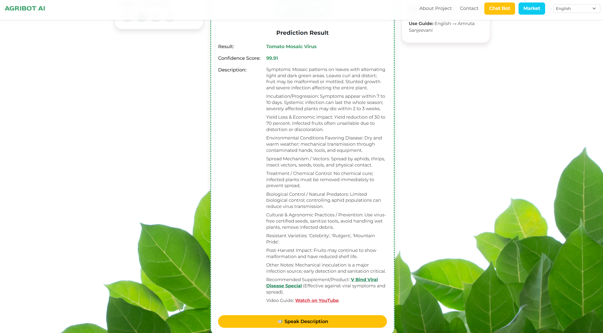
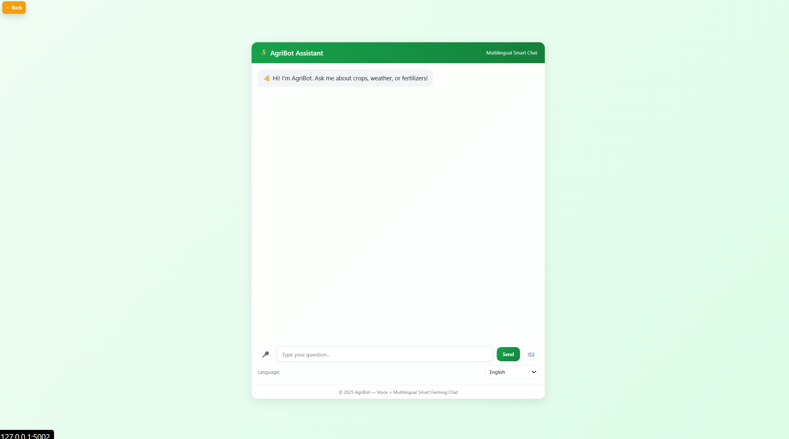
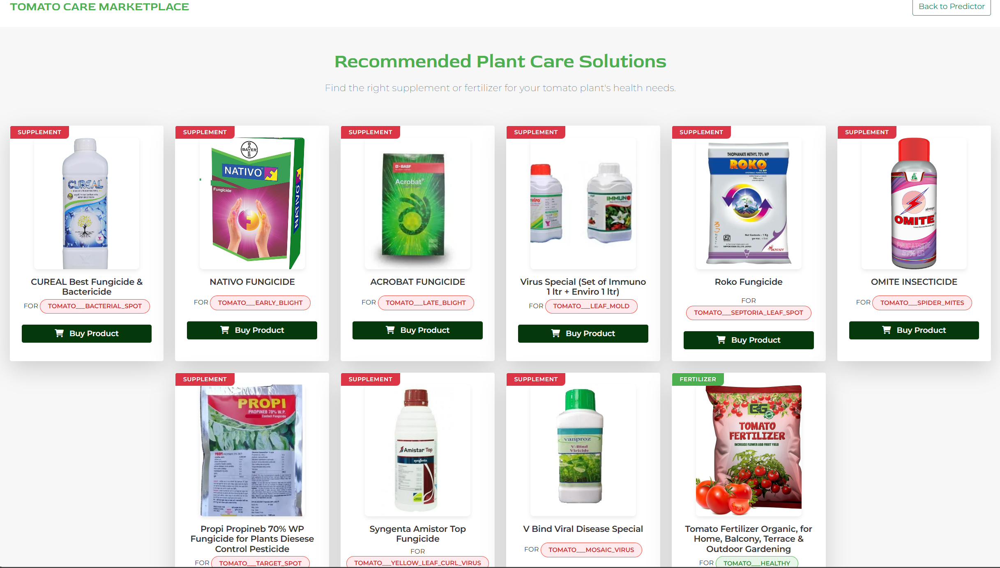
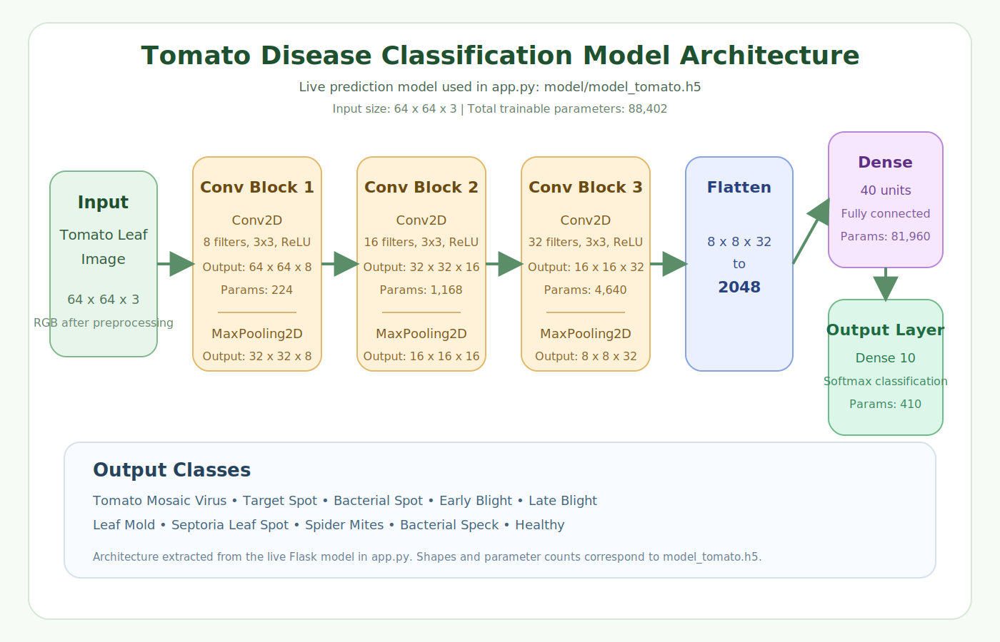

# Tomato Disease Classification

AI-powered tomato leaf disease detection web app built with Flask and TensorFlow, with multilingual farmer support, spoken descriptions, market recommendations, and an agriculture chatbot.

## UI Preview

Web app:

<p align="center">
  
</p>

Prediction result:

<p align="center">
  
</p>

About page:

<p align="center">
  
</p>

Chatbot page:

<p align="center">
  
</p>

Market page:

<p align="center">
  
</p>

Model architecture:

<p align="center">
  
</p>

## Features

- Upload tomato leaf images and predict disease class using a TensorFlow CNN model
- Detect healthy leaves and 9 tomato disease classes
- Use the app in English, Hindi, Kannada, Telugu, and Tamil
- View detailed disease descriptions after prediction
- Open language-specific YouTube guide links from the description panel
- Listen to disease descriptions with built-in text-to-speech
- Ask agriculture-related questions in the AgriBot chatbot
- Use external chatbot API support with local fallback replies
- Explore recommended supplements and products in the marketplace
- Access Agrimart details and language-based farmer helpline contacts
- View translated About/Project content from the web interface

## Detected Classes

The app supports 10 tomato classes:

1. `Tomato Mosaic Virus`
2. `Target Spot`
3. `Bacterial Spot`
4. `Early Blight`
5. `Late Blight`
6. `Leaf Mold`
7. `Septoria Leaf Spot`
8. `Spider Mites`
9. `Bacterial Speck`
10. `Healthy`

## Tech Stack

- Python
- Flask
- Flask-Cors
- TensorFlow / Keras
- OpenCV
- Pillow
- pandas
- deep-translator
- gTTS
- python-dotenv
- Waitress

## Project Structure

```text
Tomato-Disease-Classification/
├── app.py
├── prediction.py
├── requirements.txt
├── supplement_info.csv
├── model/
├── static/
├── templates/
│   ├── index.html
│   ├── about.html
│   ├── market.html
│   └── chat-bot.html
└── assets/
```

## How It Works

1. User uploads a tomato leaf image.
2. The Flask backend preprocesses the image.
3. The TensorFlow model predicts the disease class.
4. The app shows:
   - disease name
   - confidence score
   - disease description
   - recommended supplement/product
   - language-specific YouTube guide
5. Users can change UI language, listen to the description, open the market page, or chat with AgriBot.

## Installation

### 1. Clone the repository

```bash
git clone https://github.com/rameshmarathi/Tomato-Disease-Classification.git
cd Tomato-Disease-Classification
```

### 2. Create and activate a virtual environment

Windows PowerShell:

```powershell
python -m venv venv
.\venv\Scripts\Activate.ps1
```

### 3. Install dependencies

```bash
pip install -r requirements.txt
```

## Environment Variables

Create a `.env` file in the project root if you want chatbot API support.

Example:

```env
DEEPSEEK_API_KEY=your_api_key_here
OPENROUTER_API_KEY=your_api_key_here
OPENAI_API_KEY=your_api_key_here
CHATBOT_API_KEY=your_api_key_here
CHATBOT_API_URL=https://openrouter.ai/api/v1/chat/completions
CHATBOT_MODEL=openai/gpt-4o-mini
```

Notes:

- The chatbot backend reads `.env` using `python-dotenv`
- If no external chatbot API key is available, the app falls back to built-in agriculture responses
- On Windows/VS Code, reopen the terminal after updating `.env`

## Run the App

```bash
python app.py
```

Then open:

```text
http://127.0.0.1:5000
```

## Main Routes

- `/` - home page with image upload and prediction
- `/predict` - model prediction endpoint
- `/describe` - disease description endpoint
- `/translate_content` - translated About page content
- `/speak` - generates spoken disease description audio
- `/about` - project information page
- `/contact` - contact page/section rendering
- `/market` - supplement and product recommendation page
- `/chat-bot` - chatbot UI
- `/chat-bot/api` - chatbot backend endpoint

## Chatbot

AgriBot supports agriculture-related questions such as:

- crop diseases
- soil health
- fertilizers
- irrigation
- pests
- weeds
- weather impact
- market planning
- harvesting
- organic farming

How it works:

- The frontend sends the question to `/chat-bot/api`
- The backend first tries the configured external LLM API
- If the API is unavailable, it falls back to local agriculture responses

## Updated UI Additions

Recent updates included in this repository:

- multilingual disease descriptions
- language-based farmer helpline card
- language-specific YouTube guide links
- chatbot backend route
- improved chat fallback logic
- speech cleanup on refresh/navigation
- speak description toggle button behavior
- faster non-English description rendering path

## Dataset

This project is based on the Tomato Leaf Disease dataset commonly used from Kaggle:

- [Kaggle Tomato Leaf Dataset](https://www.kaggle.com/kaustubhb999/tomatoleaf)

## Model Notes

- CNN-based tomato disease classification
- Live Flask model: `model/model_tomato.h5`
- Input size used by the app: `64 x 64`
- Prediction pipeline is served through Flask

## Desktop App

The repository also includes a Windows installer:

- `Install Tomato.exe`

Example desktop screenshots:

<p align="center">
  
</p>

<p align="center">
  
</p>

<p align="center">
  
</p>

## Deployment

The project includes:

- `Dockerfile` for containerized deployment
- `.github` workflow support for automation

Basic Docker usage:

```bash
docker build -t tomato-disease-classifier .
docker run -p 8080:8080 tomato-disease-classifier
```

## Important Notes

- Use `numpy==1.26.4` with the current TensorFlow setup in this repo
- If the chatbot shows fallback responses, check whether the external API key is valid and reachable
- If the chatbot page still behaves like an old version, do a hard refresh with `Ctrl+F5`

## Author

<<<<<<< HEAD
Ramesh Marathi 
=======
Ramesh Marathi  
>>>>>>> 6f883d8 (Update author information in README)
Bangalore, Karnataka, India

- Phone: `+91 9483446327`
- Email: `rameshmarathi7765@gmail.com`

## License

This project is for educational and practical agricultural assistance purposes. Add a formal license here if you want public reuse terms such as MIT.
